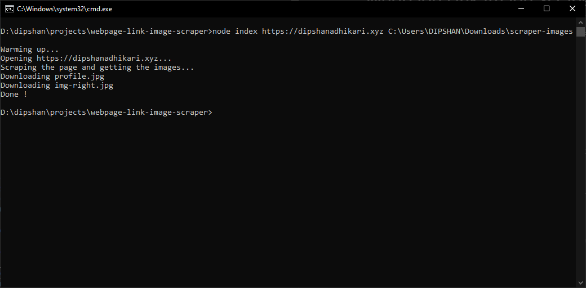

<h1 align="center">Webpage Link Image Scraper</h1>
<h3 align="center">
  A tool that can scrape and download all of the images found on a website
</h3>

<br>



## Built with

-   [Puppeteer](https://pptr.dev/): To open and scrape the page for getting the image URLs
-   [Axios](https://axios-http.com/) : To download the images
-   [File System](https://nodejs.org/api/fs.html): To save the images on your computer.

## Usage

To clone and run this application, you'll need [Git](https://git-scm.com/downloads) and [Node.js](https://nodejs.org/en/download/) (which comes with npm) installed on your computer. From your command line:

```bash
# Clone the repository
$ git clone https://github.com/dipshanadh/webpage-link-image-scraper

# Go to the downloaded folder
$ cd webpage-link-image-scraper

# Install necessary packages
$ npm install

# Then run this command
$ node index <URL> <location>
```

Replace `<URL>` with actual page URL and `<location>` with acutal download location if you also download want to download

## Author

### Dipshan Adhikari

-   Github : [dipshanadh](https://github.com/dipshanadh)
-   Facebook : [dipshanadh](https://facebook.com/dipshanadh)
-   Instagram : [dipshanadh](https://instagram.com/dipshanadh)
-   Twitter : [@dipshanadh](https://twitter.com/@dipshanadh)
